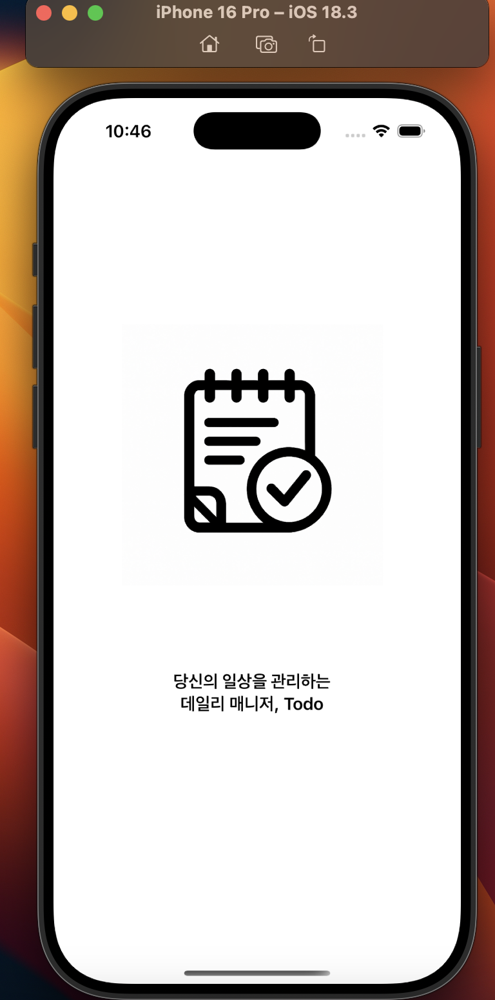
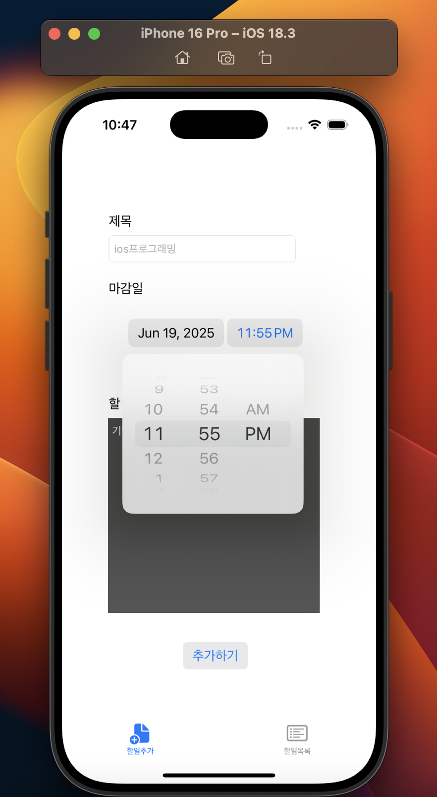
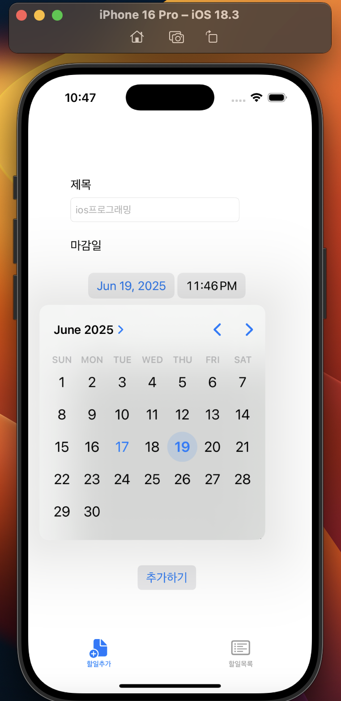
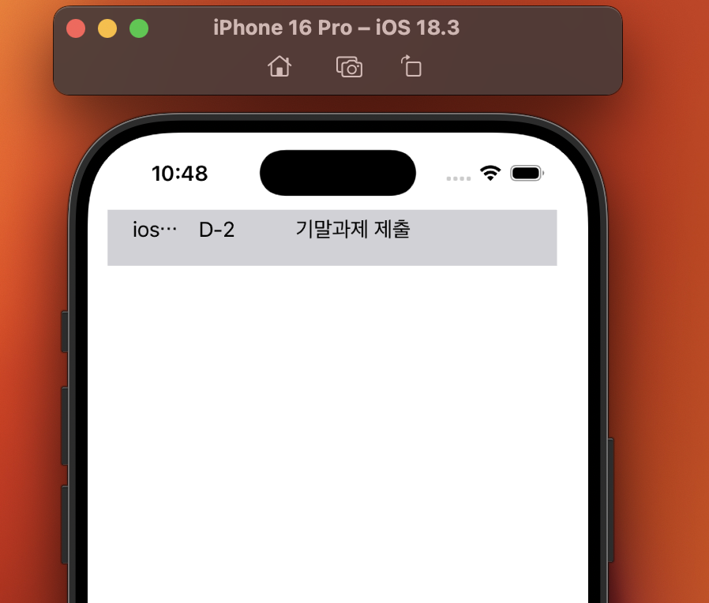
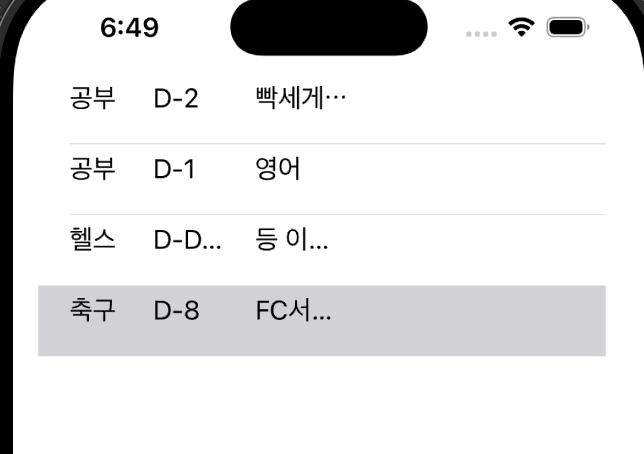

# ios_finalProj_1871503
ios프로그래밍 기말대체 미니프로젝트 1871503 박규성
# MiniToDo

## 1. 프로젝트 수행 목적

### 1.1 프로젝트 정의

• 하루 할 일들을 관리할 수 있는 간단한 To-Do List iOS 앱 개발

### 1.2 프로젝트 배경

• 학생들의 가장 큰 개인 관점은 일정 관리의 빠지는 것이다. 가기 다른 지역에서의 수집적 일정 노포트와 연계되어 가장 간단하고 해당 가능한 앱은 To-Do이다.

### 1.3 목표

• 할 일의 제목, 날짜, 세부 내용을 입력
• 추가 수 밖에 받지 않고, 목록에 보여지도록 함
• D-Day 표시로 사용자에게 감각적 효과 제공
• 지방 테이블에서 각 할 일을 선택 후 도치를 통해 목록에서 삭제 가능

---

## 2. 프로젝트 개요

### 2.1 프로젝트 설명

• Swift + UIKit 가능성을 활용한 간단한 iOS To-Do 개설
• UserDefaults 를 통해 각 할 일의 날짜, 제목, 세부내용을 저장
• UITableView 게이트와 D-Day 계산 기능 구현

### 2.2 개발 구조

```
- MainTabBarController (Tab 형식): 
    - 할일추가 Scene
    - 할일목록 Scene

- ViewController: TodoListViewController, AddTodoViewController
- Model: Todo.swift (title, dueDate, detail)
- UserDefaults: 저장 및 불러오기 용도
```

---

### 2.3 결과물

#### 런치스크린


#### 할일추가

  
  


#### 할일목록


---

### 2.4 기대효과

• 목록에서 D-Day 계산이 가능해서 사용자가 날짜 가정을 효율적으로 관리 가능
• 만든 할 일의 세부 내용이 많아지면 이름 표시 다운 트랙 필요 가능 (cell auto height / label lines=n)
• 테이블에서 그대로 삭제 가능

---

### 2.5 관련 기술

| 구분           | 설명                         |
| ------------ | -------------------------- |
| Swift/UIKit  | Apple 개발자용 간단 iOS UI 개발 기술 |
| UserDefaults | 간단한 데이터 저장구                |
| UITableView  | 각 개체의 할 일들을 표시하는 구조        |

---

### 2.6 개발 도구

| 구분    | 설명                         |
| ----- | -------------------------- |
| Xcode | iOS 개발을 위한 Apple 공용 IDE    |
| Swift | iOS가 가장 크게 사용하는 바이트가 Swift |

---

### 2.7 발표영상

▶▶ [MiniToDo Youtube 영상 보기](https://youtu.be/RY1yOuUKAiM)

---

개발자: 박규성 (1871503)
